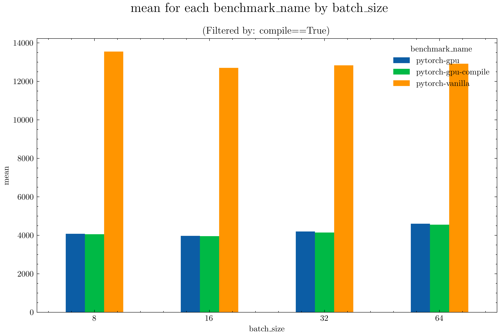

### Transform Benchmark 📊

Here the results of a couple of benchmarks to see if running transformations on GPU is faster than doing so on CPU with multiprocessors (so inside `torch.utils.data.Dataset`).

Here the results, `time` are in `ms`.




Doing augmentation on GPU is around **4x faster**. This is mostly due to the fact that **we send a torch.uint8** image to the GPU that is way smaller than `torch.float32`.

This is more or less how you can code it

```python
dl = Dataloader(...)

for batch in dl:
    batch = (
        batch.to('cuda').float().div_(255)
    )
    batch = transform(batch)
```

Since we will doing augmentation (resize, etc) on the GPU we don't need to convert the image to `float32` (or `float16`) before sending it.

Transformations are normal `nn.Module`, so we can also call `torch.compile` on them.

E.g. a `Resize` can be implemented as

```python
class Resize(nn.Module):
    def __init__(self, size: Tuple[int, int]):
        super().__init__()
        self.size = size

    def forward(self, x: Tensor) -> Tensor:
        return F.interpolate(x, size=self.size)
```

A `RandomFlip` like

```python

class RandomFlip(nn.Module):
    def __init__(self, p: float = 0.5, dim: int = -1):
        super().__init__()
        self.p = p
        self.dim = dim

    def forward(self, x: Tensor) -> Tensor:
        flip_mask =  (
            torch.zeros(
                x.shape[0], 1, 1, 1, device=x.device, dtype=torch.bool
            ).bernoulli_(self.p)
        )
        x_flipped = x.flip(self.dim)
        x.mul_(~flip_mask)
        x.addcmul_(flip_mask, x_flipped)
        return x
```

We have way more control here, and we can take advantage of inplace operations to avoid wasting precious GPU memory.
